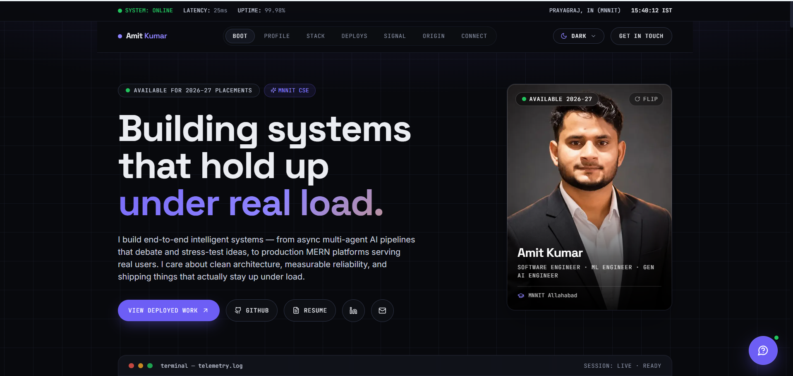

<div align="center">

# Amit Kumar — Portfolio

### Software Engineer · ML Engineer · Gen AI Engineer

Final-year CSE @ MNNIT Allahabad — building production-grade multi-agent AI systems,
RAG pipelines, and full-stack MERN platforms.

[](https://portfolio-pink-nine-u94pgycalv.vercel.app)
[](https://github.com/AmitK241)
[](https://www.linkedin.com/in/amit-kumar-3a602a289)

</div>

<br/>

<div align="center">
  
  <br/><sub>Replace this with an actual screenshot of the deployed site before publishing.</sub>
</div>

<br/>

## About this project

A personal developer portfolio built as a **"systems dashboard"** — instead of a
generic template, the whole site is styled like a live telemetry monitor: a
status bar with real uptime/latency readouts, a boot-sequence hero, and project
cards that look like deployed services. The design is a deliberate reflection of
the kind of work showcased inside it — async pipelines, production reliability,
and multi-agent orchestration.

## ✨ Features

| | |
|---|---|
| 🎨 **4 distinct themes** | Dark, Light, Matrix (terminal-green), and Paper (editorial serif) — full re-skins, not just palette swaps |
| 🖼️ **Interactive flip-card profile** | Front/back 3D flip with photo + quick-connect details |
| 📊 **Live GitHub telemetry** | Followers, repos, and stars fetched client-side from the GitHub API in real time |
| 🗂️ **Bento-grid project showcase** | Featured flagship project + 5 supporting projects, each with live/demo/submitted status |
| 🎓 **Certifications gallery** | Verified-link certs (HackerRank, Coursera) + image-based lightbox certs |
| 💬 **"Ask about Amit" assistant** | Floating chat widget that answers common recruiter questions via local keyword-matching over this repo's own data — no external API, fully static |
| 📍 **Location radar widget** | Hover-to-reveal coordinates card |
| ♿ **Accessible** | ARIA labels, keyboard navigation, focus states, `prefers-reduced-motion` support throughout |
| ⚡ **Fully static** | No backend, no database — builds to static HTML, deployable anywhere |

## 🛠️ Tech stack

<div align="center">


</div>

- **Framework:** Next.js 14 (App Router) + TypeScript
- **Styling:** Tailwind CSS with a CSS-variable-driven theme system (`app/globals.css`)
- **Animation:** Framer Motion — scroll reveals, 3D tilt cards, spring physics
- **Fonts:** Self-hosted via `@fontsource` (Space Grotesk, Inter, JetBrains Mono, Fraunces) — zero external font requests, so it builds offline/in CI
- **Icons:** Lucide React
- **Deployment:** Vercel

## 📂 Project structure

```
.
├── public/                  # Static assets, certificate images
├── src/
│   ├── app/                 # Next.js App Router — pages, layout, SEO (sitemap, robots)
│   ├── components/          # All UI components (Hero, Projects, Nav, AskAssistant, ...)
│   └── lib/
│       ├── data.ts          # Single source of truth for all site content
│       └── assistant.ts     # Local Q&A knowledge base for the Ask Assistant widget
├── tailwind.config.ts       # Design tokens (theme-aware CSS variables)
└── package.json
```

**To update any content on the site** (bio, projects, skills, certifications,
achievements) — edit `src/lib/data.ts`. No component code changes needed.

## 🚀 Getting started

```bash
# Clone
git clone https://github.com/AmitK241/Portfolio.git
cd Portfolio

# Install
npm install

# Run locally
npm run dev
```

Open [http://localhost:3000](http://localhost:3000).

```bash
# Production build
npm run build
npm run start

# Lint
npm run lint
```

## 🌐 Deployment

Deployed on **Vercel** — pushes to `main` deploy automatically. To deploy your
own copy:

1. Push this repo to your GitHub.
2. Import it at [vercel.com/new](https://vercel.com/new) — Next.js is
   auto-detected, no configuration needed.

## 📬 Contact

Open to **SDE, ML Engineer, and Gen AI Engineer** roles — 2026–27 campus
placement cycle.

- **Email:** [amitkumarv7880@gmail.com](mailto:amitkumarv7880@gmail.com)
- **LinkedIn:** [amit-kumar-3a602a289](https://www.linkedin.com/in/amit-kumar-3a602a289)
- **GitHub:** [@AmitK241](https://github.com/AmitK241)
- **LeetCode:** [amit5646](https://leetcode.com/u/amit5646/)

---

<div align="center">
<sub>Built by Amit Kumar with Next.js, Tailwind CSS & Framer Motion.</sub>
</div>
